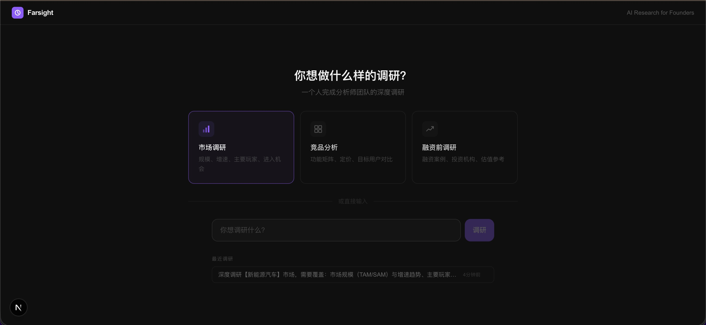
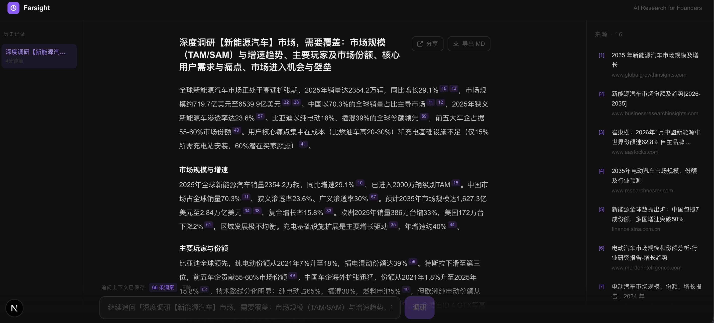

# Farsight

> **AI Research for Founders** — A deep research tool that works like a full analyst team. Ask a question, get a structured report — automatically.

English · [中文](./README.zh.md)

---

## Screenshots





---

## Features

- **Deep Research** — Automatically decomposes questions, runs multi-round searches, scrapes full pages, extracts insights, and generates a structured report
- **Competitor Analysis** — Detects comparison intent and builds a structured competitor matrix automatically
- **Follow-up Questions** — Continue digging based on previous results (refine / expand / new topic modes)
- **Inline Citations** — Every `[n]` in the report is clickable and scrolls to the matching source
- **History** — Research sessions persisted locally, accessible across page reloads
- **Share Links** — One-click read-only share page at `/r/[id]`
- **Markdown Export** — Download the full report including competitor matrix and source list

## Architecture

```
app/
├── page.tsx              # Main UI (SSE consumer / report renderer / history)
├── r/[id]/page.tsx       # Read-only share page (Server Component)
└── api/
    ├── research/         # Research SSE stream
    └── history/          # History CRUD

lib/
├── engine/
│   ├── planner.ts        # LLM-generated research plan
│   └── scheduler.ts      # Parallel skill execution by stage
├── skills/               # Pluggable skill modules (community contributions welcome)
│   ├── web-search.ts     #   Tavily web search
│   ├── web-scraper.ts    #   Playwright full-page scraping
│   ├── key-extractor.ts  #   Insight extraction
│   ├── report-generator.ts
│   └── matrix-builder.ts
├── llm/
│   └── adapter.ts        # Unified Claude / MiniMax adapter with JSON retry
└── db/
    └── index.ts          # JSON file history persistence
```

Execution pipeline: `collect` → `parse` → `analyze` → `output`. Tasks within the same stage run in parallel.

## Getting Started

### Local Development

**Requirements:** Node.js 20+, pnpm

```bash
git clone https://github.com/finvfamily/farsight
cd farsight
pnpm install
pnpm playwright install chromium   # install browser for scraping
cp .env.local.example .env.local   # fill in your API keys
pnpm dev
```

Open [http://localhost:3000](http://localhost:3000)

### Docker

```bash
cp .env.local.example .env.local   # fill in your API keys
docker-compose up
```

## Environment Variables

| Variable | Required | Description |
|----------|----------|-------------|
| `ANTHROPIC_API_KEY` | ✅ | [Get one](https://console.anthropic.com/) |
| `TAVILY_API_KEY` | ✅ | Web search API — [Get one](https://tavily.com/) (1,000 free calls/month) |
| `MINIMAX_API_KEY` | Optional | MiniMax M2.5 for extraction tasks — [Get one](https://platform.minimaxi.com/) |

## Adding a New Skill

Skills are the core extension point. Each skill is a self-contained module:

```typescript
// lib/skills/my-skill.ts
import { buildContext } from '@/lib/engine/skill-runtime'

export default {
  async execute(
    inputs: Record<string, unknown>,
    ctx: ReturnType<typeof buildContext>
  ) {
    // your implementation
    return { result: '...' }
  },
}
```

Register it in `SKILL_MAP` inside `lib/engine/scheduler.ts` and the Planner will automatically schedule it.

See [CONTRIBUTING.md](./CONTRIBUTING.md) for full details.

## Roadmap

- [x] Scenario entry points (market research / competitor analysis / funding prep)
- [ ] Mobile responsive layout
- [ ] PDF export
- [ ] User auth / per-user history
- [ ] New skills: company registry data, App Store reviews, tech news RSS
- [ ] Continuous tracking — subscribe to a topic and get weekly updates

## Contributing

PRs are welcome! See [CONTRIBUTING.md](./CONTRIBUTING.md) to get started.

## License

[Apache 2.0](./LICENSE)
